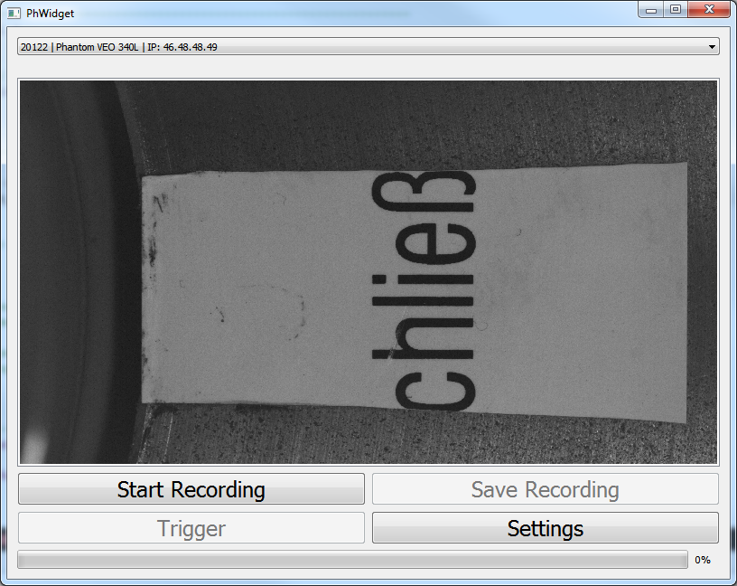
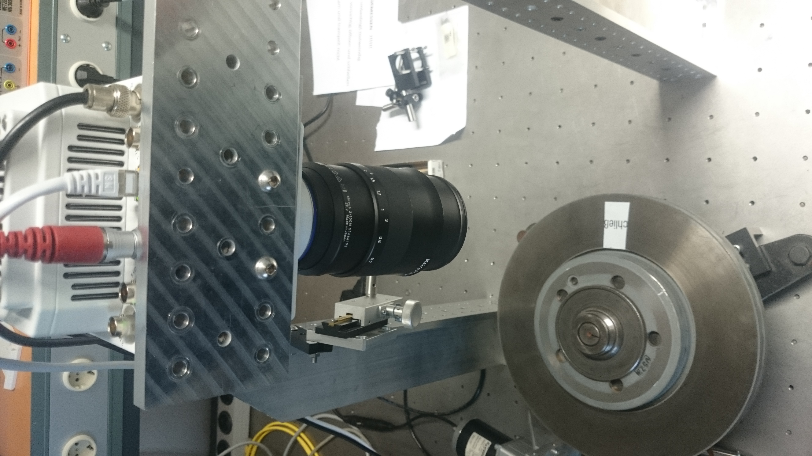

## Software-Integration einer Highspeedkamera in C++ für die Verwendung in einem optischen Messaufbau

Zur Integration einer Highspeed-Kamera in eine bestehende Messumgebung soll ein Widget erstellt werden. Das Widget verwendet dazu das Phantom SDK (Software Development Kit), um die Kamera zu steuern. Dazu zählt das Starten und Beenden einer Aufnahme, das Einstellen von Aufnahmeparametern, das Anzeigen des Live-Bilds und das abschließende Abspeichern der Aufnahme. Das Widget wird zunächst unter Verwendung einer simulierten Kamera erstellt. Abschließend wird die Implementation am Messaufbau mit einer [Phantom VEO-E 340L](https://www.phantomhighspeed.com/products/cameras/veo/veoe340l) getestet.

